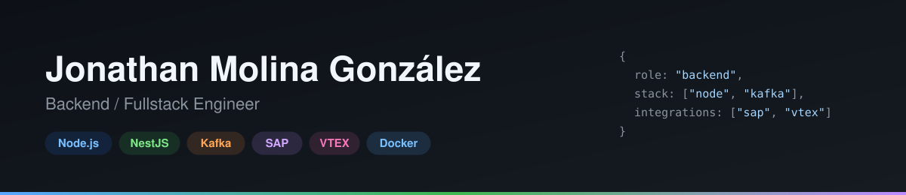

<h1>Hi, I'm Jonathan Molina 👋</h1>

Fullstack Engineer focused on **backend microservices** — Node.js, event-driven architecture, and ERP/e-commerce platform integrations (SAP, VTEX).

### 👨‍💻 About Me

- 🏗️ I build and maintain services for an omnichannel retail **Order Management System (OMS)** — order lifecycle, fulfillment routing, inventory, pricing, purchasing, finance and POS, around 70 independent services communicating through Kafka and REST.
- 🔌 My strongest area is **ERP and platform integrations** — SAP Business One (Service Layer) and VTEX.
- 🌱 Currently sharpening event-driven architecture patterns (Outbox/Inbox, idempotent consumers).
- 📫 Reach me at [Gonzalezjoni6@gmail.com](mailto:Gonzalezjoni6@gmail.com) or [LinkedIn](https://www.linkedin.com/in/jonathan-patrick-molina-gonzález-2abb69281).

### 🛠 Tech Stack

**Backend**

**Frontend**

**Integrations & tools**

### 📌 Featured projects

- 🔗 **[order-sync-service](https://github.com/Yoni1999/order-sync-service)** — event-driven order sync between an OMS, a SAP-style ERP mock, and a VTEX-style commerce mock, built with NestJS, Kafka and the Outbox pattern.
- 🛠️ **[Software_Ferreteria](https://github.com/Yoni1999/Software_Ferreteria)** — desktop inventory management app for a hardware store (Tauri + React + TypeScript + Rust).

### 📫 Get in touch

